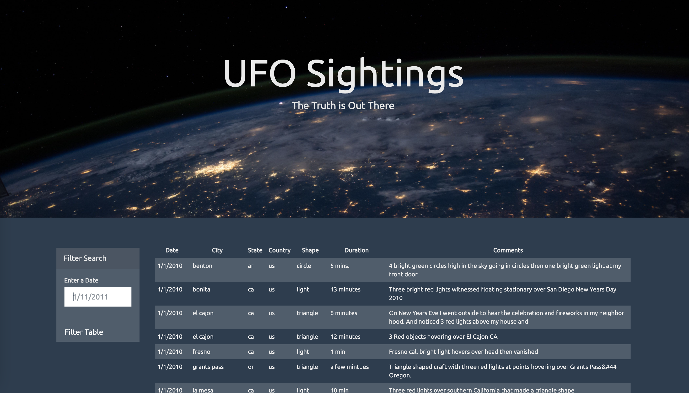
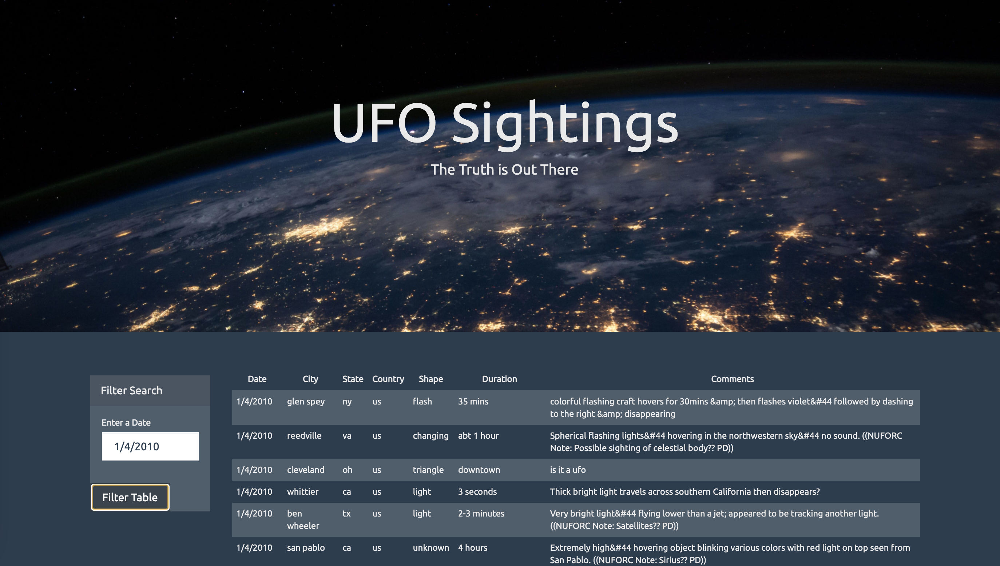

# **JavaScript Challenge: JavaScript and Dom Manipulation**

## **Level 1: Automatic Table and Date Search**
 
Using the UFO <a href="UFO-level-1/static/js/data.js"> dataset </a> provided in the form of an array of JavaScript objects, write code that appends a table to your web page and then adds new rows of data for each UFO sighting.

 

The table will contain columns for:
 * Date
 * City
 * State
 * Country
 * Shape
 * Comment 

 

 
 
  

Use a date form in your HTML document and write JavaScript code that will listen for events and search through the date/time column to find rows that match user input.

 
 
  

 ## **Level 2: Multiple Search Categories**
  

Using multiple input tags and/or select dropdowns, write JavaScript code so the user can to set multiple filters and search for UFO sightings using the following criteria based on the table columns:
 * Date
 * City
 * State
 * Country
 * Shape

